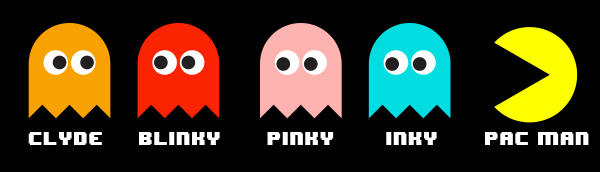
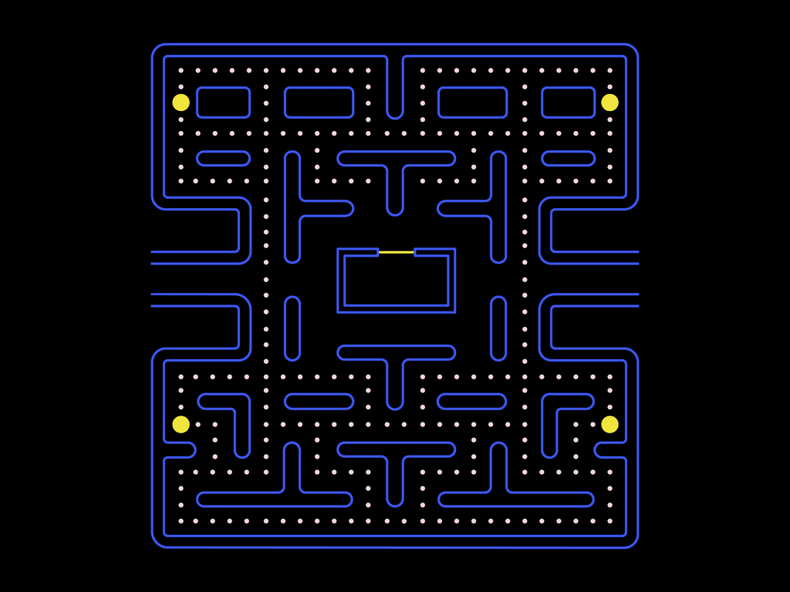

# Functional Specifications

Table of content

- [Functional Specifications](#functional-specifications)
  - [Overview](#overview)
    - [What is Pac-Man](#what-is-pac-man)
    - [How to play](#how-to-play)
  - [Game mechanics](#game-mechanics)
    - [Map and movements mechanics](#map-and-movements-mechanics)
    - [points and power pellets mechanics](#points-and-power-pellets-mechanics)
  - [Deliverables](#deliverables)
  - [Project timeline](#project-timeline)
  - [Project scopes](#project-scopes)
  - [Stakeholders](#stakeholders)
  - [Personas](#personas)
  - [Use cases](#use-cases)
    - [Thibaud, 8 years old:](#thibaud-8-years-old)
    - [Alice, 17 years old, high school student:](#alice-17-years-old-high-school-student)
    - [Claire, 27 years old, developer:](#claire-27-years-old-developer)
    - [Jacques, 65 years old:](#jacques-65-years-old)
    - [Titouan, 35 years old, gaming enthusiast:](#titouan-35-years-old-gaming-enthusiast)
  - [Out of scope](#out-of-scope)
  - [Non-functional requirements](#non-functional-requirements)
  - [Laws and regulations](#laws-and-regulations)
  - [Cost analysis](#cost-analysis)
  - [Risk and assumptions](#risk-and-assumptions)
    - [Risks](#risks)
    - [Assumptions](#assumptions)
  - [Success criteria](#success-criteria)
  - [Test plan](#test-plan)
  - [Team members](#team-members)
  - [Glossary](#glossary)

## Overview

The goal of the project is to recreate the famous game "Pac-Man" with our own style using Assembly [^1] code and limiting the computer performance with the computing power of a computer of the 80s.

### What is Pac-Man

Pac-Man is a video game published in 1980 by the company Bandai Namco. The game was playable on arcade. 

It consist on a yellow, round shaped character named "Pac-Man" eating "Pac-dots" on a 2D map.

The antagonists are little ghosts, four of them can be seen in the game. Each ghost has a name related to it's color except for the orange one.

  
Each ghost has its own behaviour:

- Clyde: Chases directly after Pac-Man, but tries to head to his Scatter corner when within an 8-Dot radius of Pac-Man.
  
- Blinky: Follows Pac-Man directly during Chase mode, and heads to the upper-right corner during Scatter mode. He also has an "angry" mode that is triggered when there are a certain number of dots left in the maze, in this mode, Blinky will chase Pac-Man with an increased speed.
  
- Pinky: Chases towards the spot 2 Pac-Dots in front of Pac-Man. Due to a bug in the original game's coding, if Pac-Man faces upwards, Pinky's target will be 2 Pac-Dots in front of and 2 to the left of Pac-Man. During Scatter mode, she heads towards the upper-left corner.
  
- Inky: During Chase mode, his target is a bit complex. His target is relative to both Blinky and Pac-Man, where the distance Blinky is from Pinky's target is doubled to get Inky's target. He heads to the lower-right corner during Scatter mode.

### How to play

The player, by controlling Pac-Man, has to eat every Pac-dots before one of the ghost catches him. If one of the ghost catches him, the player will lose a life and has to continue the level.

When the player loses all of his three lives, a screen displaying it's score will appear and the arcade will updates the top 10 high-score if needed.

The player can use either a joystick or arrows on the keyboard to play. Moving the joystick to one direction or pressing an arrow will move Pac-Man to this direction until hitting a wall.

 On the center of the leftmost and rightmost walls there is a path to teleport to the opposite side of the map, this path is commonly named "Tunnel".

 On each corners you can see bigger Pac-dots, they are called "Power pellets", when eating them, ghosts turns blue and will avoid Pac-Man, but if the player catches one of them, he will gain bonus points and the ghost will return in the center of the map to return to life and restart the chase.

 Multiple elements or actions in the game provide the player with points, here is a full table of these elements:

| Points        | Element/action |
|:-------------:|:--------------:|
| 10 Pts        | Pac-dot        |
| 50 Pts        | Power pellet   |
| 200 Pts       | 1st Ghost      |
| 400 Pts       | 2nd Ghost      |
| 800 Pts       | 3rd Ghost      |
| 1600 Pts      | 4th Ghost      |
| 100 Pts       | Cherry         |
| 300 Pts       | Strawberry     |
| 500 Pts       | Orange         |
| 700 Pts       | Apple          |
| 1000 Pts      | Melon          |
| 2000 Pts      | Galaxian       |
| 3000 Pts      | Bell           |
| 5000 Pts      | Key            |

Note: by 1st/2nd/3rd/4th ghost it means ghosts eaten by Pac-Man under the effect of a Power pellet.

 If the player achieve to get 10 thousand points, he will get an additional life, it happens for each multiple of 10 thousand.

## Game mechanics

The original Pac-Man game contains multiple mechanics, here is a list of them. 

### Map and movements mechanics

The map is composed of a maze, on the center of it there is a small "room" where ghosts are starting from. The player can't access this room.

Walls are represented by blue lines. The player and the ghosts cannot pass through wall.

The player and the ghost can move using four directions: up, down, left and right. Unlike more recent games the players cannot mix two directions at the same time.

Finally on the left and on the right a "tunnel" can be seen, when taking it the player is teleported to the other side of the map. The ghosts can also take the tunnel but taking it will reduce their speed for one second.

### points and power pellets mechanics

In the original Pac-Man game fruits can be found under the "ghost's room", these fruits depends on the level and each of them gives a different amount of [points](#point-table).

Each dots and power pellets are also giving a small amount points.

When eating a power pellet Pac-Man can gain a short-timed bonus from 6 to 1 second depending on the level.
Under the duration effect of a power pellet, ghosts will try to avoid Pac-Man as much as possible, when reaching a ghost, Pac-Man will eat it, making it invisible and the player will earn points. After being eaten a ghost will go straight to the ghost room. When it reaches the room, the ghost will reappear with their normal form.

After reaching a multiple of 10 thousand in points, the player will be given a bonus life.

## Deliverables

Our client, ALGOSUP, asked us to deliver documents and the final product on precise dates.

|Date|Deliverable|
|:-:|:-:|
|13/11 1.30pm| Functional specification deadline|
|27/11 1.30pm| Technical specification deadline|
|8/12 5pm| Test plan deadline|
|11/12 5pm| Working prototype deadline|
|21/12 5pm| Final product deadline|

## Project timeline

Our team has collectively decided to stick to a timeline.

|Date|Objective|
|:-:|:-:|
|11/27/2023 - 12.30pm|Map is usable | 
|11/27/2023 - 12.30pm|Player character can be played | 
| 11/27/2023 - 12.30pm |ennemies & their behaviours are added |
|12/04/2023 - 5.00pm|Power-ups can be collected |
| 12/08/2023 - 12.30pm |Lives are implemented |
| 12/11/2023 - 5.00pm |Difficulty is set and levels are implemented |
| 12/14/2023 - 12.30pm|Score is calculated and displayed |
| 12/15/2023 - 12.30pm|High Score is saved |

## Project scopes

Our project's goal is to create a "Pac-Man" like game, this games must meet these scopes:

- The game must have a gameplay similar to the game "Pac-Man",
- The game must have an interface to allow users to interact with the game,
- The game must have at least a win and a lose condition,
- The game must be different enough from the game "Pac-Man" to avoid the possibility of legal actions.

## Stakeholders

|Image|Name|
|:-:|:-:|
||ALGOSUP|
|-|Team 2|

## Personas

## Use cases

### Thibaud, 8 years old:

Thibaud excitedly sits in front of the computer, ready to play the recreated Pac-Man game. With simple controls and vibrant graphics, he navigates through the mazes, collecting pellets and avoiding ghosts. Thibaud giggles with delight as he completes each level, feeling a sense of accomplishment. The accessible gameplay and engaging visuals keep him entertained, making the Pac-Man project his new favorite game.

### Alice, 17 years old, high school student:

After a long day of classes, Alice decides to take a break and explore the Pac-Man project. Despite not being a regular gamer, she finds the user-friendly[^2] interface and simple controls easy to navigate. The nostalgic elements of the classic game bring back childhood memories. Alice enjoys a quick gaming session, appreciating the break from her academic routine and the opportunity to explore a different aspect of technology.

### Claire, 27 years old, developer:

Claire, a developer with a busy schedule, decides to unwind by trying out the Pac-Man project. Although not directly involved in its development, she appreciates the clear project objectives and the collaborative environment. Claire explores the technical aspects with curiosity, recognizing the efforts put into recreating the classic game. The project becomes a source of both relaxation and a chance to appreciate game development from a user's perspective.

### Jacques, 65 years old:

Jacques, a nostalgic gamer, sits down to play the recreated Pac-Man on his computer. Guided by a user-friendly interface and simple controls, he navigates through the mazes, reminiscent of his past gaming experiences. Despite initial concerns about technology, Jacques finds the project accessible and comfortable. The nostalgic elements evoke fond memories, creating an enjoyable gaming session that bridges the gap between classic and modern gaming.

### Titouan, 35 years old, gaming enthusiast:

Scenario: Titouan, a gaming enthusiast with a versatile history of playing Pac-Man, eagerly explores the Pac-Man project. With a mix of nostalgia and curiosity, he appreciates the versatility in gameplay and the project's efforts to capture the essence of the classic game. Titouan engages with the community, sharing insights based on his gaming expertise. The project becomes a platform for him to not only enjoy a beloved classic but also contribute to the gaming community.

## Out of scope

The project also has some out of scope objectives, there are as following:

- Playing music and sound in-game, we are focusing on having a playable game first, the sound effects are not a top priority for our team,
- Display a main menu at the start of the game and a Highest scores menu at the end of a game,
- Creating the equivalents of fruits, they only give bonus points and aren't a core part of the gameplay.

## Non-functional requirements

The project contains non-functional requirements which are the following:

The game must react to player's action in less than a second, the player cannot be subject to input latency.

The game must be understandable for young players, it shouldn't require more than ten minutes to comprehend the gameplay.

The game should be playable on a x86 emulator.

## Laws and regulations

The legal landscape for a project like recreating Pac-Man in assembly x86 with DosBox[^3] involves considerations related to intellectual property[^4], copyright, and other regulations. Here are some key aspects we are mindful of:

**Software distribution regulations:**
- The game Pac-Man is under trademark. It means any reference or uses of its characters or the use of the source code by other companies can be declared as illegal and thus the owner of the trademark can pursue legal action against infringing company.

**Age and content ratings:**
- In adherence to age and content rating regulations, our project aligns with the PEGI[^5] 3 rating, signaling its suitability for users of all age groups. We prioritize transparency by clearly communicating the intended audience, ensuring that the content is specifically crafted to be appropriate for individuals aged three and above. This commitment extends to the design, themes, and any interactive elements within the game. 
By conforming to the PEGI 3 rating, we aim to provide a safe and enjoyable gaming experience for users of diverse age ranges. The clarity in age and content communication not only fulfills regulatory requirements but also assists users and parents in making informed decisions about the suitability of our game for their audience. 

**Privacy regulations:**
- By processing data such as the collect of player's experience by using the "score" we should ensure players are aware of this. Consent and awareness of our users must be mandatory in case of data collection. 

**Consumer protection laws:**
- In our game development project, we are committed to upholding consumer protection laws to ensure a positive and transparent user experience. Our game description provides accurate and detailed information about the gameplay and any features present in the game. We prominently display terms of service and privacy policies, outlining how user data is handled and protected.

**Minimization of data collection:**
- Our data, being limited to player's score and being locally stored, players can safely stay anonymous.

## Cost analysis

- Project Duration: 
  - November 6, 2023, to December 22, 2023 (47 days).
- 24 project times slots of 3.5 hours each with a team of 6 people.
- 24 x 3.5 = 84.
- 84 hours are allocated to this project.

## Risk and assumptions

### Risks

**Technical challenges:**
- Unforeseen technical challenges in implementing assembly x86, DosBox integration, or other game development aspects may lead to delays or difficulties in achieving the desired functionality.

**Legal hurdles:**
- Legal challenges related to securing copyright clearance for Pac-Man or other legal considerations may pose obstacles to the project's progression.

**Resource constraints:**
- Unexpected shortages or constraints in resources, including human resources or software tools, may impact the project's ability to meet deadlines or maintain quality standards.

**Unforeseen legal changes:**
- Changes in intellectual property or copyright laws during the project's development may introduce unforeseen legal complications.

**Unpredictable technical issues:**
- Unpredictable technical issues, such as compatibility problems on different systems or devices, may arise during the testing phase.
  
### Assumptions

**Technical expertise:**
- The development team possesses the necessary technical expertise in assembly x86, DosBox, and game development to successfully recreate Pac-Man.

**Legal compliance:**
- The project assumes that legal considerations, including trademark clearance for Pac-Man, will be successfully navigated to ensure compliance with intellectual property laws.

**User engagement:**
- There is an assumption that users will engage positively with the recreated Pac-Man game, fostering community participation and potential future enhancements.

**Timely completion:**
- The project assumes that it will be completed within the specified timeline, avoiding significant delays or disruptions.

**Quality assurance:**
- The testing and quality assurance processes will effectively identify and address any bugs or issues, ensuring a polished and functional game.

## Success criteria

The project will be considered as successful if all of these criterias have been met:

- The game display every element without any kind of stuttering,
- The player can control the character without latency between the player action and game's reaction,
- The player can progress amongst levels the same way as the original game,
- The game does not return errors on launch,
- The game does not crashes,
- The player can loose if conditions are met.

## Test plan

Anything relative to this project's tests can be found in [this document](./Test_plan.md).

## Team members

|Name|Role|Photo|E-mail|
|:-:|:-:|:-:|:-:|
|Clémentine Curel|Senior software engineer| |clementine.curel@algosup.com|
|Laurent Bouquin|Project manager| |laurent.bouquin@algosup.com|
|Aurélien Fernandez|Program manager||aurelien.fernandez@algosup.com|
|Mathias Gagnepain|Junior software engineer||mathias.gagnepain@algosup.com|
|Gaël Malvar|Quality assurance||gael.malvar@algosup.com|
|Paul Nowak|Tech lead||paul.nowak@algosup.com|

## Glossary

[^1]: Assembly Code:
Low-level programming language specific to a computer architecture. Used in this project to create the Pac-Man game.

[^2]: User-Friendly:
Design and functionality that are easy for users to understand and navigate.

[^3]: DosBox :
An emulator that allows running old games on modern computers.

[^4]: Intellectual Property:
Legal rights that result from intellectual activity in industrial, scientific, literary, and artistic fields.

[^5]: PEGI (Pan European Game Information):
A European video game content rating system to inform consumers about the suitability of games for different age groups.

