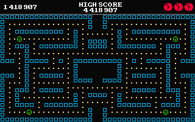
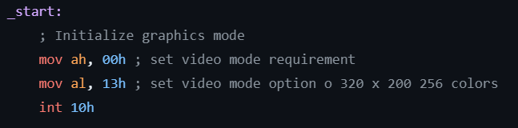
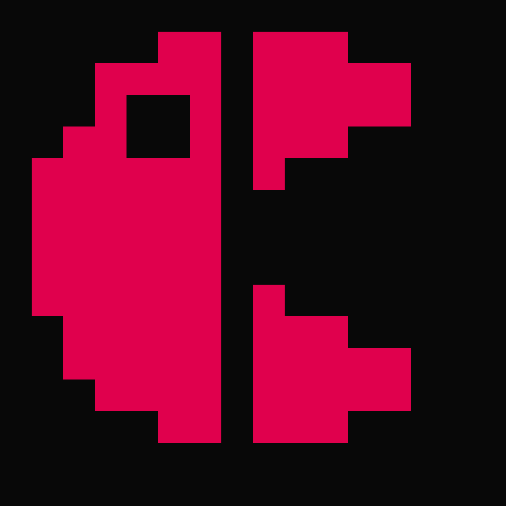
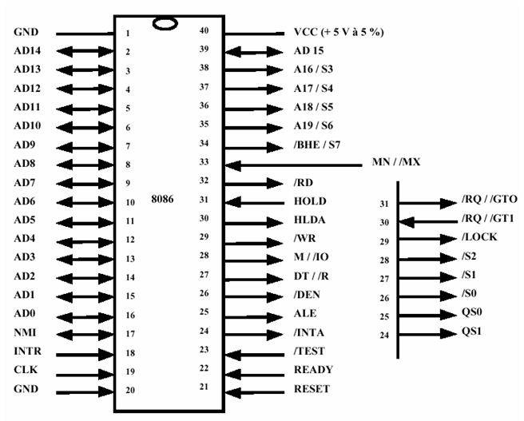
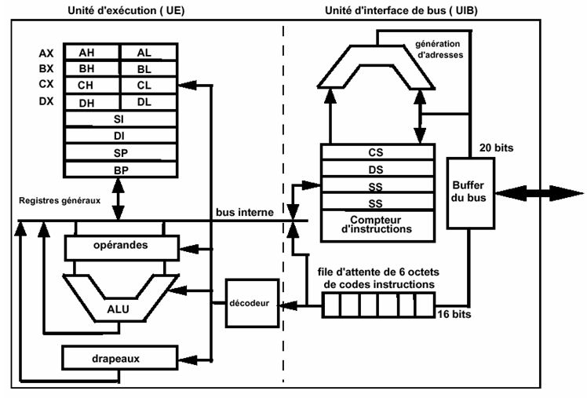
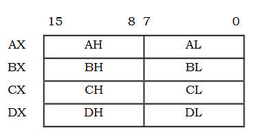
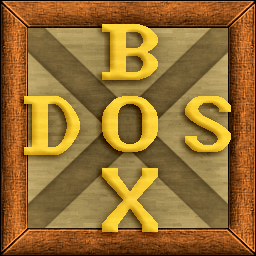
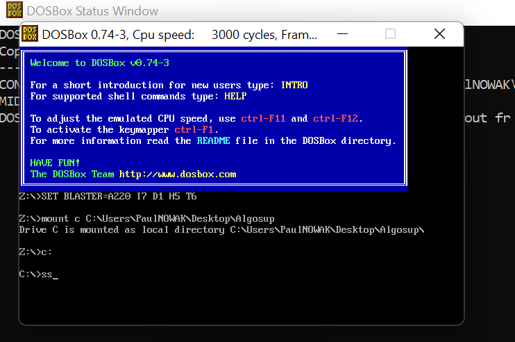

# Technical Specifications

Table of content

- [Technical Specifications](#technical-specifications)
  - [Overview](#overview)
    - [Short presentation](#short-presentation)
    - [Goal](#goal)
  - [Technical requirements](#technical-requirements)
    - [Proposed solution](#proposed-solution)
    - [Decisions taken](#decisions-taken)
      - [Key Handler](#key-handler)
      - [Screen Resolution](#screen-resolution)
    - [Other solutions](#other-solutions)
    - [Out of scope](#out-of-scopes)
  - [Gameplay](#gameplay)
    - [Game screen](#game-screen)
    - [Controls](#controls)
    - [Mechanics and rules](#mechanics-and-rules)
    - [Sprites gallery](#sprites-gallery)
      - [Hero](#hero)
      - [Ghosts](#ghosts)
      - [Others](#others)
    - [Demo](#demo)
  - [Technologies](#technologies)
    - [Programming language](#programming-language)
    - [x86 Microprocessor](#x86-microprocessor)
    - [Processus of installation](#processus-of-installation)
    - [Dependencies](#dependencies)
    - [Problems encountered](#problems-encountered)
  - [Tools used](#tools-used)
    - [DosBox](#dosbox)
    - [Gimp](#gimp)
  - [Glossary](#glossary)

## Overview

### Short presentation
Pac-Man (originally named Puckman in english) is a 1980 arcade game developped by the japanese video game company called Bandai Namco Entertainment Inc and designed by Toru Iwatani.

First released in Japan, it became a massive success in the United States where more than 100 000 units were sold in 1 year.

In his game, Pacman must eat all the pac-dots present in a maze while he is chased by 4 ghosts. However, he can eat super-powered pellets where he gets temporarily the power to devour his enemies !

Today, the character became a cultural icon of the video game industry which the popularity has crossed the globe.

### Goal
Our goal is to recreate our own version of a Pac-Man game while using our own creative and technical choices.

However, we are required to use the Assembly programming language which include limited computer features. Furthermore, we have to use DOSBOX, an emulator recreating a MS-DOS environment.

## Technical requirements

### Proposed solution
Our solution is a game named "Dev Track": it's a 1-player maze action game that is close to the original's game's aspect and gameplay. 

However, our version will propose a different map and different sprites for the characters involved. Furthermore, this game will be played on PC and ran on the DosBox virtual machine.

When making that game, we want to trigger to the player a feeling of challenge, because the game tends to be harder at each level, and a feeling of achievement after he managed to succeed.

### Decisions taken
During the planning phase of our game, several critical choices must have been done in order to avoid a catastrophic phase of development:

#### Key Handler
To anticipate the different kinds of player who are right-handed or left-handed, we have decided to allow different game controls, like arrow keys or other keyboard keys.

So, we plan to incorporate several variables that have several keyboard keys assigned to them (Ex: "Go UP" variable connected to Up Arrow key or W Key).

Furthermore, the key handler must detect the same scancode regardless if it's uppercase or lowercase.

#### Screen Resolution
Originally, we planned to have a screen resolution of 640*800 pixels, for a total of 307 000 pixels. The problem is that our game is limited to a 16-bit game can only support up to 65 536 pixels, which isn't enough to provide such a screen quality.

So, we had decided to opt for a 320*200 pixels resolution, with a total of 64 000 pixels.

In addition, we had to reduce the sprites' size from 16*16 to 8*8 pixels.

### Other solutions

The plan of our maze was originally much bigger and would take most of the screen size. However, we expected to experiment graphics issues in case we have to reduce the screen resolution, and we also needed to include the score.

Here are some concepts of maze that were considered during the project's development:

CONCEPTS

### Out of scope
First of all, we have decided to exclude the bonus fruits in our game due to time constraints. We believed that it was the less important feature to implement, and we would have replaced them with other kinds of food (Soda, etc...) if we had time.

Then, we didn't want to add sound and music in our game. Indeed, we prefered to focus on the functional requirements of our Pac-Man and ignore its sound aesthetics.

Also, we have no plan for creating the hero's death animation, the enemies' eyes moving on their own, and a small score number when we eat an enemy.

## Gameplay

### Game screen
This is how the game screen looks like in our game:

Dev Track's maze occupies most of the entire screen, while upper-top band hows a black area containing the actual score, the high score and the number of Pac-Man's remaining lives.

To display the maze, we use the "SVGA/MCGA/ATI VIP" video mode in order to display each walls, setting up the tunnels where the characters are allowed to roam in, and displaying external content.

For that, we need to enter the interrupt "10h" that will allow us to use a 320*200 definition.

### Controls
For controling our hungry red ball, we use the keyboard touches to move the character from a x-z plane fixed camera movement.

Indeed, we can either used the arrows keys to move our hero, or for the left-handed players, we can use the WASD keys.

Moving through the maze will be the only thing the player could do with our character, as the latter will automatically interact with the other game systems (enemies, pac-dots..;) when entering in collision with them.

### Game Physics

#### Characters speed

To set up the character's speed, for either Ranky or the bugs, we will move them with a velocity of of a certain pixels per second.

Indeed, each frame will be incremented by a few pixels to give the illusion that the characters are actually moving. 

Furthermore, a velocity variable will be created for speed variations. These variations will occur when:
  - Ranky will eat a check (power-up), which will increase his speed and reduce the bug's speed for a short while.
  - At each level, everyone will have a boost of speed to increase the game's difficulty.

#### Characters movement

For moving through the maze, every characters will be able to move in 4 directions: LEFT, RIGHT, UP and DOWN.

Indeed, we have to create a function that will make the character moves while
having different parameters depending on the characters' intended direction. While the player's direction will depend on the keyboard inputs, the bugs's movement will be calculated by AI.

Each of the bugs possesses a different AI when following Ranky, but we have chosen to not create our own AI for time constraints. So, we decided to retrieve the original game's respective AIs for programming the ghosts by adapting them to our game.

For that, we plan to make the code set up the path they need to take depending on their whereabouts and how they perceive Ranky.

And at last, the characters should be able to go in the opposite direction instantly at any moment.

#### Collision detection

We need to avoid making the characters cross walls, items or enemies.

Effectively, we need to program a collision detection for Ranky and the bugs and determinate how they perceive the other actors of the game:
  - If Ranky bumps into a wall, he should stop at 2 pixels apart from his sprite.
  - If Ranky crosses an enemy, either in attack or scared mode, he either kills or be killed if 80% of his collision area detects him.
  - If Ranky eats a candy or a check, he will detect the item from 5 pixels around his center point.
  - If a bug runs into another bug with 2 pixels of distance separing them, they will both split and go in opposite direction.

#### Characters states

Both Ranky and the ghosts have different states depending on the situation, so here's a state diagram to illustrate them:

STATE DIAGRAM

As you can see, Ranky as a normal state when he is vulnerable to his enemies, and also a "hungry" mode after he eats a check where he can eats bugs for a short while.

Concerning the bugs, they will start to follow their specific AI patterns in their "attack mode". However, they will eventually go in their "scatter mode" where each monster will wander in the 4 different corners of the maze.

The event will happen several times before the enemies stay definitely in "attack mode" as long as the level/game isn't over.

### Score and HighScore
To calculate the score after each items and enemies eaten we have to create a function that calls a points database and detect how many times Ranky ate a snack. 

The score will be displayed on screen and updated in real time, so we should perform quick operations in the registers and send the result to the readScore function as soon as possible.

For implementing the Highscore, each time a player finish the game (or has a Game Over), the program will save a score data that will be registered within the game's database. 

Each time a new player will launch the game, it will read all the existing highscore database before selecting the best one and display it on the game screen.

### Class diagram
Finally, here's a view on the different classes the game will need:

CLASS DIAGRAM

### Sprites gallery

#### Ranky

Ranky's sprite (Pac-Man's long lost cousin ?) is based on the ALGOSUP's logo.

|         Sprite         |                  Name                   |  Size  |               Details              |
| :------------------: | :------------------------------------------: | :------------------: | :------------------: |  
| |   Ranky-opened mouth    |  16*16  | Fixed animation when Ranky is in his idle animation, but also used alternatively during moving animation. |
|  |   Ranky-closed mouth    |  16*16  | Used alternatively during moving animation. |    

#### Bugs
We created new sprites for enemies, now called bugs, with different designs and different names.

|         Sprite         |                  Name                   |  Size  |               Details              |
| :------------------: | :------------------------------------------: | :------------------: | :------------------: |  
| |   Ranky-opened mouth    |  16*16  | Fixed animation when Ranky is in his idle animation, but also used alternatively during moving animation. |
|  |   Ranky-closed mouth    |  16*16  | Used alternatively during moving animation. |    

#### Others
We created new sprites for the pac-dots now called "candies", the power-up named "checks", and the maze's wall blocks.

|         Sprite         |                  Name                   |  Size  |               Details              |
| :------------------: | :------------------------------------------: | :------------------: | :------------------: |  
| |   Ranky-opened mouth    |  16*16  | Fixed animation when Ranky is in his idle animation, but also used alternatively during moving animation. |
|  |   Ranky-closed mouth    |  16*16  | Used alternatively during moving animation. |   

### Demo
Here's a (upcoming) demo of our game:

UPCOMING DEMO

## Technologies 

### Programming language
The Algosup School imposed us the use of the Assembly language, more particularly x86 Assembly.

Assembly is the lowest language available of software programming that is the closest of the machine language. Indeed, it allow us to access to all of what is possible to do with our computer, as it's important to understand how a machine works for the programming complexity.

Futhermore, the language requires less memory and execution time, and will be more suitable for hardware-specific complex tasks.

Now, our team is stick to use the x86 Assembly version due to DosBox being a x86 emulator.

### x86 Microprocessor REGISTERS ARE ENOUGH

To simulate the technical limitations of MS-DOS, Franck told us to use the 16-bit microprocessor Intel 8086 for making our game which can also work on a modern machine. It's a 40-pin DIL-shaped integrated circuit as shown in the following figure:

Mostly used for desktop computers and launched in 1978, this processor has a clock speed from 5 to 10 MHz, a cache memory of 64 KB and a maximum memory capacity of 1 MB. 

Here's the intern architecture of the device:

As you can see, there are 2 intern units:
  - the Bus Interfaccing Unit (BIU) , which retrieves and stores the data to be processed, and establish transmissions with the system buses.
  - the Execution Unit (EU), that executes the instructions which are transmitted by the BIU.

Within the EU, 16-bit registers can be used in all arithmetic and logical operations that the programmer inserts into the code.

These 8 registers are separated into 2 groups:

  - 4 data 16-bit registers that can be separated into 2 8-bit registers.

  

  - 4 16-bit registers used for pointers and indexes, more specifically adapted to the processing of elements in memory. They generally have increment and decrement properties.

### Processus of installation
AAA

### Dependencies
AAA

### Problems encountered
AAA

## Tools Used 

### DosBox
We were required to use the virtual machine DosBox: it's an emulator recreating the MS-DOS environment that can run many classic MS-DOS games as long as they aren't modified.

First, we download and install the emulator's latest version: DosBox 0.74-3.

However, it needs some location to emulate a virtual Hard Drive while the computer's hard drive is much larger than the ones used when MS-DOS was commercially available. When we open the emulator, we are welcomed with a terminal that reads Z:\>. Though, users cannot write data here as it only exists for DosBox purposes.

To remedy the issue, we have to create a realistic and safe path environment in order to run our DOS software. For that, we should define a path somewhere in our hard disk that will be treated like a virtual hard disk.

Then, we need to mount a drive: mount is a command inside DosBox that can connect physical folders and drives to virtual drives. 

For that, we select a folder (a sub-folder of the target folder is recommanded) as a drive where the DOS files will be stored and have DOSBox fool its games/applications into thinking that is the C: drive.

Once we found our target path, we enter this command:

  - mount c "Target Path"

We click enter and the drive C will be mounted as a local directory.

Now that the command prompt will be set up, we will be able to compile and run .asm files.

### Gimp
For creating the concepts of our maze and sprites, we used Gimp as a designing tool.

It's an high quality framework for scripted image manipulation that provides us sophisticated tools to create, modify and enhances images.

## Glossary
The goal

|         Term         |                  Definition                   |  
| :------------------: | :------------------------------------------: | 
| Maze Game |   Ranky-opened mouth    |
| Microprocessor |   Ranky-opened mouth    |
| virtual machine |   Ranky-opened mouth    |
| drive |   Ranky-opened mouth    |
| sprite |   Ranky-opened mouth    |
| Register |   Ranky-opened mouth    |
| Emulator |   Ranky-opened mouth    |
| Animation |   Ranky-opened mouth    |
| A.I. |   Ranky-opened mouth    |
| Collision |   Ranky-opened mouth    |
| Interrupt |   Ranky-opened mouth    |
| Key Handler |   Ranky-opened mouth    |
| Resolution |   Ranky-opened mouth    |

